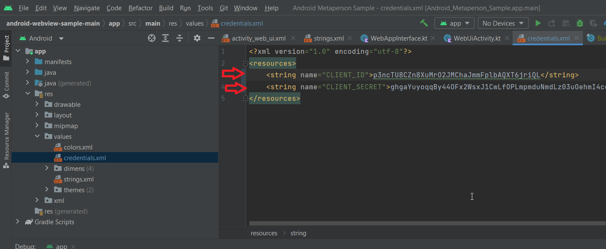

# MetaPerson Android sample
This demo project shows how the MetaPerson avatars can be integrated into your native Android applications. It uses the mobile version of the [MetaPerson Creator]([https://mobile.metaperson.avatarsdk.com/](https://mobile.metaperson.avatarsdk.com/)) which helps you to create and customize your lifelike avatars. 
## Getting started
First, you should clone the repository to your local drive. Open your project in Android Studio and find the "credentials.xml" file (app/src/main/res/values/credentials.xml):

Fill in the CLIENT_ID and CLIENT_SECRET parameters with the values from your [Avatar SDK developer account](https://accounts.avatarsdk.com/developer/). Please note that if you make a mistake in your CLIENT_ID or CLIENT_SECRET, you won't be able to export your avatar! Once the parameters are set, build and run the application on your device. 
Inside the application: 
- Press the "Create MetaPerson" button
- Create your personal avatar.
- Once you finished an avatar's customization, press the "Export" button to create a download link.
- Once the link is created you can download your avatar (link is copied to the clipboard).
## How It Works

The sample project is written in Kotlin and consists of two activities: 
java/com/avatarsdk/metaperson/MainActivity.kt and java/com/avatarsdk/metaperson/WebUiActivity.kt. MainActivity is the starting activity that sets up button handlers: open web view if "Create MetaPerson" is pressed and open the mail app if the "Email" button is pressed.
```kotlin
binding.createButton.setOnClickListener {  
    openMetapersonCreator()  
}  
binding.mailButton.setOnClickListener{  
    val emailIntent = Intent(Intent.ACTION_SENDTO).apply {  
        data = Uri.parse("mailto:support@avatarsdk.com")  
    }  
    startActivity(Intent.createChooser(emailIntent, "Send feedback"))  
}
```
The WebUiActivity is responsible for communication with the MetaPerson creator. It uses the WebView class to display the MetaPerson creator on screen. The WebView object is created and initialized in the onCreate function. The WebAppInterface class is responsible for handling the result of the avatar export. We are injecting a Java object named metapersonJsApi into WebView. 
```kotlin
webView!!.addJavascriptInterface(WebAppInterface(this, webView!!), "metapersonJsApi")
```
When the onPageStarted callback of the WebView is called, we execute Javascript code that creates event handlers and forwards the JavaScript call to the metapersonJsApi.showToast method. Here is the Javascript code ([See more information about JS API](https://docs.metaperson.avatarsdk.com/js_api.html)):
```js
function onWindowMessage(evt) {
    if (evt.type === 'message') {
        if (evt.data?.source === 'metaperson_creator') {
            let data = evt.data;
            let evtName = data?.eventName;
            if (evtName === 'mobile_loaded') {
                onMobileLoaded(evt, data);
            } else if (evtName === 'model_exported') {
                metapersonJsApi.showToast(evt.data.url);
            }
        }
    }
}

function onMobileLoaded(evt, data) {
    let authenticationMessage = {
        'eventName': 'authenticate',
        'clientId': '$clientId',
        'clientSecret': '$clientSecret',
        'exportTemplateCode': '',
    };
    evt.source.postMessage(authenticationMessage, '*');
    let exportParametersMessage = {
        'eventName': 'set_export_parameters',
        'format': 'glb',
        'lod': 1,
        'textureProfile': '2K.png'
    };
    evt.source.postMessage(exportParametersMessage, '*');

}
document.addEventListener('DOMContentLoaded', function onDocumentReady() {
    window.addEventListener('message', onWindowMessage);
});
```
The "showToast" method does two simple things: it displays a [toast](https://developer.android.com/guide/topics/ui/notifiers/toasts) with a link to exported avatar and copies that link to the clipboard. This is a good place to start if you want to, for example, integrate MetaPerson avatars into your application and download and display them.
### Export Parameters

Export parameters allow you to customize the output of the exported avatar by specifying textures resolution, mesh format, and level of detail.

- **format** - specifies the mesh format of the exported avatar. Supported formats: **gltf**, **glb**, **fbx**.
- **lod** - specifies the level of detail (LOD) for the exported avatar mesh. The higher the value, the less detailed mesh. Possible values: **1** and **2**.
- **textureProfile** - specifies the texture profile for the exported avatar (textures resolution and format). Possible values: **4K.png**, **2K.png**, **1K.png**, **4K.jpg**, **2K.jpg**, **1K.jpg**, **4K.webp**, **2K.webp**, **1K.webp**.

## Model Loader

This sample exports avatars in **glb** format.  
The exported model URL contains a link to a ZIP archive.  

## Support

If you have any questions or issues with the sample project, please contact us [support@avatarsdk.com](mailto:support@avatarsdk.com).
